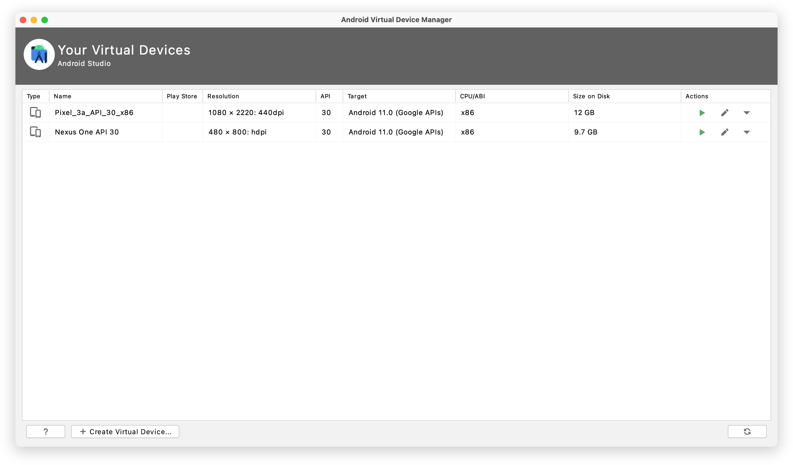

# Frida-Tutorial
Tutorial para el uso de Frida

## Explicación

Este repositorio pretende ayudar a todos aquellos programadores que desean utilizar el paquete de herramientas de Frida, vitaminado con el uso de comandos para la gestión de los emuladores mediante ADB.

La intención es desarrollar el tutorial con los pasos naturales sobre el proceso al completo.

## Requisitos

Este manual requiere contar con Python instalado y Android Studio.

## Manual

## 1. Instalación de Frida
Ejecutamos en consola el comando "pip install frida-tools".

## 2. Automatización de emulador
Para la apertura del emulador de Android Studio vamos a utilizar "subprocess" de Python, definiendo el string identificativo del emulador Android.

`subprocess.Popen(["export ANDROID_SDK=$HOME/Library/Android/sdk && export PATH=$ANDROID_SDK/emulator:$ANDROID_SDK/tools:$PATH && emulator @Pixel_3a_API_30_x86"],shell=True)`

El string identificativo del emulador puede encontrarse dentro del gestor de emuladores del propio Android Studio.



Es recomendable crear un sleep con Python dependiente del tiempo de apertura y estabilización del propio emulador de Android. Este tiempo es totalmente dependiente de la RAM de la máquina.

`time.sleep(70)`

## 2. Lanzamiento de la Aplicación
La apertura de la aplicación se realiza por el comando **adb shell monkey** y definiendo el identificador único de la aplicación instalada. La forma más sencilla de localizar el identificador es consultar la ruta de la propia aplicación en la Google Play.

`subprocess.Popen(["adb shell monkey -p my.application -c android.intent.category.LAUNCHER 1"],shell=True)`

## 3. Copiado del servidor Frida
Para simplificar la configuración del servidor Frida recomiendo hacer un copiado automatizado mediante ADB. El servidor Frida puedes localizarlo en los realeases disponibles de Frida en [este enlace](https://github.com/frida/frida/releases).

`command = 'adb push /Users/my-computer/Desktop/server /data/local/tmp/'
proc = subprocess.Popen(command, stdout=subprocess.PIPE, shell=True)
proc.wait()`

Una vez subido el archivo, se recomienda modificar los permisos del mismo, para ser ejecutado sin necesidad de instalar aplicaciones de super usuarios. La forma de hacerlo es ejecutar el siguiente comando:

`command = 'adb shell  "su 0 chmod 755 /data/local/tmp/server"'
print(command)
proc = subprocess.Popen(command, stdout=subprocess.PIPE, shell=True)
proc.wait()`

Lo único relevante de este comando es definir el mismo path del emulador donde se ha alojado el servidor.

## 4. Ejecución de Frida
Este paso simplemente ejecuta el servidor Frida dentro del propio emulador mediante ADB.

```
command = 'adb shell "su 0 /data/local/tmp/server"'
print(command)
proc = subprocess.Popen(command, stdout=subprocess.PIPE, shell=True)
```

## 5. Almacenamiento del código del Interceptor
Una de las soluciones más cómodas es la de crear un archivo externo en Javascript, para ser posteriormente introducirlo por Frida en el momento de interceptar las clases deseadas.

```
path = '/Users/my-computer/Desktop/interceptor.js'
file = open(path, 'r')
js = file.read()
```

Una forma de facilitar la comunicación entre Javascript y Python es reescribir partes del propio Javascript mediante Python con líneas del tipo:

`
Java.perform(Main("test","my.class.to.interceptor"));`


## 6. Validación de Emuladores a Interceptar

Este procedimiento permite al programador validar el número de emuladores disponibles para ser interceptados. Generalmente solemos tener múltiples dispositivos conectados, por lo que filtrarlos correctamente facilita la automatización del proceso.

```
devices = frida.get_device_manager().enumerate_devices()
```


Esta función de Frida retorna todos los emuladores y dispositivos disponibles. Personalmente realizo un filtrado simplificado tal que así:

```
i = 0
while(i<len(devices)):
    name = str(devices[i])
    if(name.find('Android')):
        device = devices[i]
    i = i + 1
```


## 7. Tiempo de Estabilización
En este punto, añado un sleep general a todo el proceso (generalmente 50 segundos) esperando tener disponible todo el procesor de la máquina y no iniciar la interceptación con procesos secundarios que aumentarán los delays de la ejecución y generando bloqueos aleatorios sobre Android. Cabe recordar que los tiempos de ejecución no pueden verse afectados por la interceptación de Frida, ya que en la mayor parte de los casos, generarán bloqueos y errores por doquier en la aplicación analizada.

## 8. Atacar una clase
Para anidar la interceptación de Frida sobre una aplicación se hace uso del siguiente comando:

`session = device.attach("my.app")`

## 9. Lanzamiento de nuestro script

El lanzamiento de nuestro script en Javascript debe realizarse una vez la aplicación a analizar está operativa.

```
script = session.create_script(js)
script.on('message', onMessage)
script.load()
sys.stdin.read()
```


En el código anterior, apreciamos una función llamada **onMessage** de Python, que será ejecutado en el lado de Javascript con los parámetros deseados. Este comportamiento permite el trabajar con comonidad sobre el hilo de Python y realizar procesos independientes al hilo de Javascript. Algo fundamental para no saturar el hilo principal de la aplicación analizada.

## 10. Filtrado de Clases
El filtrado de clases es la tarea más tediosa del análisis de una aplicación. Inicialmente resulta fascinante consultar todas las clases de una aplicación, pero generalmente el volumen de clases resulta demasiado grande para su análisis conjunto, por lo que requiere particionarlo. 

```
Java.perform(function() {
  Java.enumerateLoadedClasses({
      onMatch: function (className) {
        if (className.includes(inspector)) {
          Java.perform(function () {
            [className].forEach(traceClass);
          });
        }
      },
      onComplete: function () {

      },
    });
});
```


La variable más importante del filtrado de funciones sobre Javascript es la variable **inspector**, que permite localizar por nombre la clase deseada.

## 11. Detección de los métodos
Una clase puede tener múltitud de métodos, mediante esta función somos capaces de volver a filtrarlos y conectarlos a todos los deseados.

```
function traceClass(targetClass) {
  var hook;
  try {
    hook = Java.use(targetClass);
  } catch (e) {
    return;
  }

  var methods = hook.class.getDeclaredMethods();
  hook.$dispose();

  var parsedMethods = [];
  methods.forEach(function (method) {
    var methodStr = method.toString();
    var methodReplace = methodStr.replace(targetClass + '.', 'TOKEN').match(/\sTOKEN(.*)\(/)[1];
    parsedMethods.push(methodReplace);
  });

  uniqBy(parsedMethods, JSON.stringify).forEach(function (targetMethod) {
    if ('call' === targetMethod) traceMethod(targetClass + '.' + targetMethod);
  });

}
```


## 12. Conexión a los métodos
Mediante la siguiente función interceptamos el método y compilamos todos los parámetros. Una vez compilados son almacenados en un objeto que será enviado a la función onMessage de Python.

```
function traceMethod(targetClassMethod) {
  var delim = targetClassMethod.lastIndexOf('.');
  if (delim === -1) return;

  var targetClass = targetClassMethod.slice(0, delim);
  var targetMethod = targetClassMethod.slice(delim + 1, targetClassMethod.length);

  var hook = Java.use(targetClass);
  var overloadCount = hook[targetMethod].overloads.length;

  for (var i = 0; i < overloadCount; i++) {
    hook[targetMethod].overloads[i].implementation = function () {
      var log = [];
      try {
        for (var j = 0; j < arguments.length; j++) {
          var arg = arguments[j];
          if (j === 0 && arguments[j]) {
            if (arguments[j].toString() === '[object Object]') {
              var s = [];
              for (var k = 0, l = arguments[j].length; k < l; k++) {
                s.push(arguments[j][k]);
              }
              arg = 'xx';
            }
          }
          log.push(arg.toString());
        }
      } catch (error) {

      }

      var retval;
      try {
        retval = this[targetMethod].apply(this, arguments); // might crash (Frida bug?)
      } catch (e) {
      }
      try {
        if (log.length > 0) {
          var content = {};
          content.method = targetClassMethod;
          content.params = log;
          send(content);
        }
      } catch (error) {
      }
      return retval;
    };
  }
}
```
